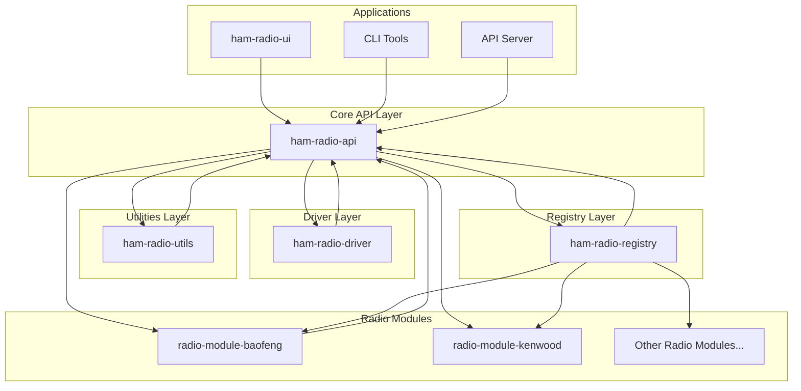

# Architecture Overview

Welcome to the HamBench ecosystem! This overview introduces the major components, their relationships, and how they work together to provide a modular, extensible platform for amateur radio programming and management.

## System Layers

The ecosystem is organized into several key layers:

- **Core API Layer**: Defines foundational types and interfaces for all modules.
- **Driver Layer**: Implements generic radio communication using a protocol DSL.
- **Utilities Layer**: Provides shared utilities, data structures, and helpers.
- **Registry Layer**: Discovers, validates, and manages radio module plugins.
- **Radio Modules**: Individual radio model support, distributed as plugins.
- **Applications**: User interfaces, CLI tools, and API servers built on top of the core layers.

## High-Level Architecture Diagram

## Key Relationships

- **API Layer**: The foundation. All other modules depend on its types and interfaces.
- **Driver Layer**: Uses the API to communicate with radios using protocol definitions.
- **Utilities Layer**: Shared helpers for memory, schema validation, logging, and more.
- **Registry Layer**: Discovers and manages radio modules, codecs, and shared components.
- **Radio Modules**: Add support for specific radios via configuration and codecs.
- **Applications**: UI, CLI, and servers use the API to interact with radios and modules.

## Why This Architecture?

- **Modularity**: Each layer has a clear responsibility and can be developed independently.
- **Extensibility**: New radios, codecs, and features can be added as plugins.
- **Maintainability**: Shared types and utilities reduce duplication and bugs.
- **Community**: Third-party developers can contribute new radio modules easily.

## Next Steps

- Explore the [Getting Started Guide](/getting-started) for hands-on setup.
- Dive into the [Developer Documentation](/developer-docs) for deeper technical details.
- See the [Reference Documentation](/reference/) for in-depth API and module information. 
