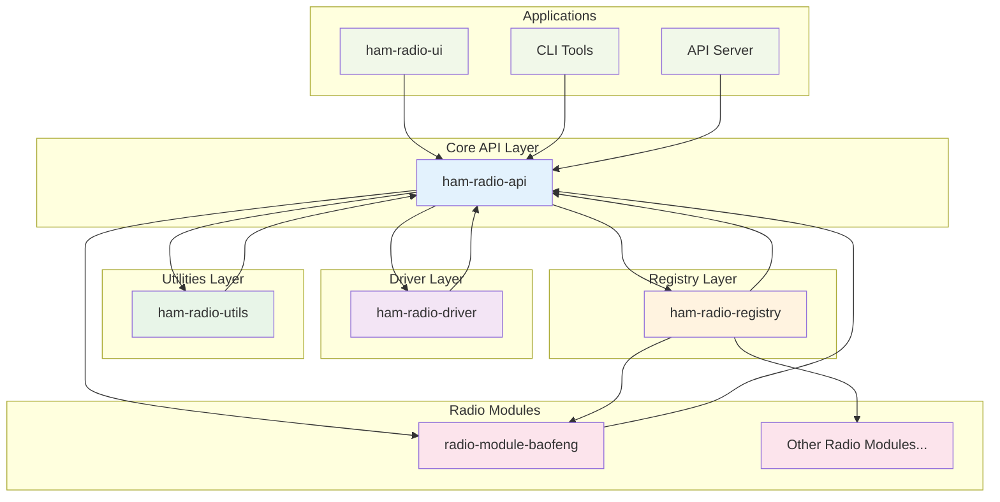
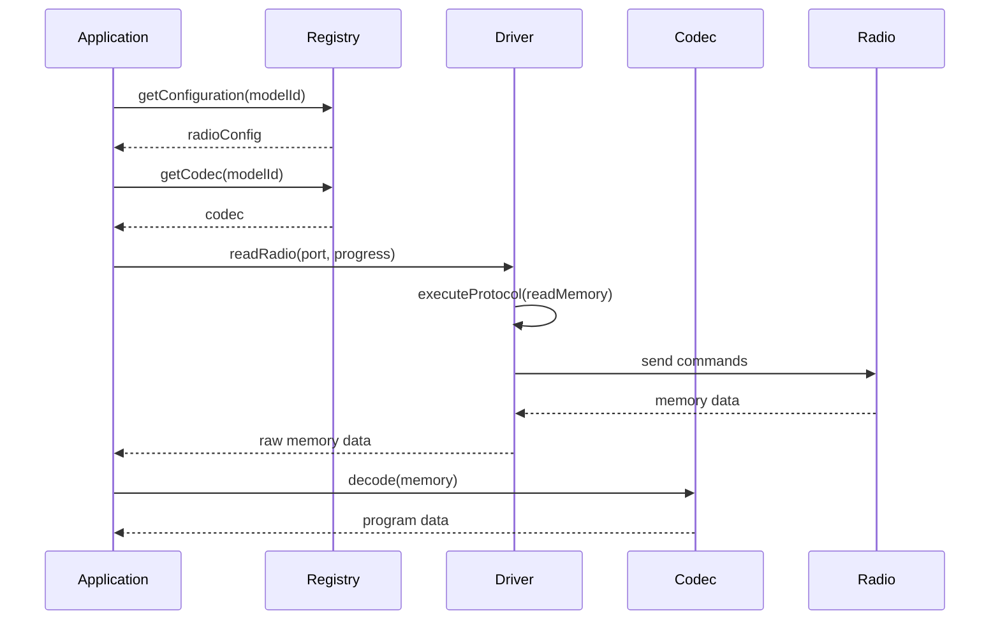
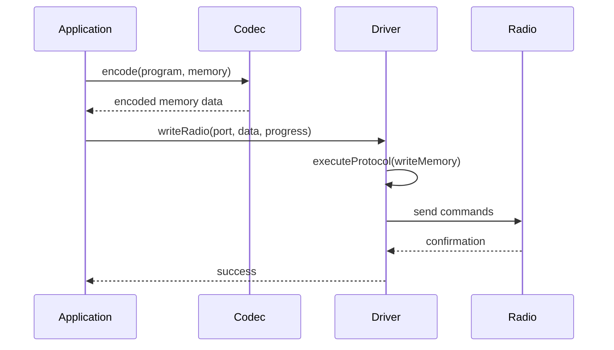
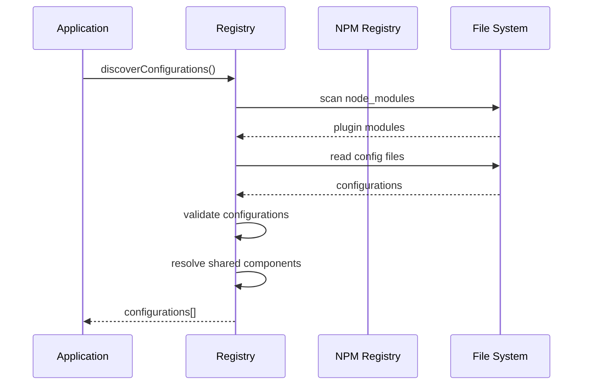

# HamBench Architecture Reference

> **Looking for a high-level introduction?** See the [Architecture Overview](/developer/architecture-overview) in the Getting Started section.

This document provides a comprehensive technical reference for the HamBench software ecosystem architecture, including detailed analysis of module responsibilities, APIs, data flow, design patterns, security, performance, and extensibility.

## System Overview

The HamBench ecosystem is designed as a modular, extensible platform for amateur radio programming and management. It consists of five core modules that work together to provide a complete solution for radio configuration, communication, and data management.



## Module Analysis

### 1. **@springfield/ham-radio-api** - Core Type Definitions

**Purpose**: Provides the foundational type system and interfaces that define the entire ecosystem.

**Key Responsibilities**:
- Define core data types and interfaces for radio operations
- Provide branded types for type safety (Frequency, RadioChannelId, etc.)
- Define radio communication protocols and memory structures
- Establish the contract between all other modules

**Core Components**:
- **Branded Types**: Type-safe identifiers for frequencies, channels, models, etc.
- **Radio Interfaces**: `RadioDriver`, `RadioCodec`, `RadioMemory`, etc.
- **Spectrum Management**: Band, mode, and privilege definitions
- **License Management**: Amateur radio license class definitions

**Key Exports**:
```typescript
// Core radio interfaces
export interface RadioDriver {
  readRadio(serialPortPath: string, progressIndicator: RadioProgressIndicator): Promise<RadioMemory>;
  writeRadio(serialPortPath: string, memory: RadioMemory, progressIndicator: RadioProgressIndicator): Promise<void>;
}

export interface RadioCodec {
  decode(memory: RadioMemory): RadioProgram;
  encode(program: RadioProgram, memory: RadioMemory): RadioMemory;
}

// Branded types for type safety
export type Frequency = Brand<number, 'Frequency'>;
export type RadioChannelId = Brand<string, 'RadioChannelId'>;
export type RadioModelId = Brand<string, 'RadioModelId'>;
```

**Dependencies**: Minimal - only `loglayer` and `ts-brand` for logging and type safety.

### 2. **@springfield/ham-radio-driver** - Protocol Interpreter

**Purpose**: Implements the core radio communication logic using a DSL-based protocol system.

**Key Responsibilities**:
- Execute radio communication protocols defined in JSON
- Handle serial port communication with radios
- Manage protocol step execution and error handling
- Provide progress tracking and cancellation support

**Core Components**:
- **RadioDriver**: Main driver class for reading/writing radio memory
- **ProtocolInterpreter**: Executes protocol steps defined in configuration
- **Step Executors**: Specialized executors for different protocol operations
- **Serial Communication**: Handles low-level serial port operations

**Key Features**:
```typescript
export class RadioDriver {
  async readRadio(serialPortPath: string, progressIndicator: RadioProgressIndicator): Promise<Uint8Array>
  async writeRadio(serialPortPath: string, data: Uint8Array, progressIndicator: RadioProgressIndicator): Promise<void>
}

export class ProtocolInterpreter {
  async executeProtocol(protocol: any, operation: 'readMemory' | 'writeMemory', buffer?: Uint8Array): Promise<void>
}
```

**Step Executors**:
- `SendExecutor`: Sends data to radio
- `ReceiveExecutor`: Receives data from radio
- `ReadSegmentExecutor`: Reads memory segments
- `WriteSegmentExecutor`: Writes memory segments
- `SetVariableExecutor`: Sets protocol variables
- `SendReceiveExecutor`: Combined send/receive operations

**Dependencies**: `@springfield/ham-radio-api`, `@springfield/ham-radio-utils`, `serialport`, `loglayer`

### 3. **@springfield/ham-radio-utils** - Shared Utilities

**Purpose**: Provides common utilities, data structures, and helper functions used across the ecosystem.

**Key Responsibilities**:
- Memory management and data conversion utilities
- Schema validation and JSON processing
- UI logging and progress reporting
- Test data factories and utilities
- Band plan and frequency management
- Operator-class mapping for FCC / Callook license lookups

**Core Components**:
- **Memory Utilities**: `SegmentedMemory`, memory data conversion functions
- **Schema Validation**: JSON schema validation using Ajv
- **UI Logging**: Progress reporting and command-level logging
- **Data Conversion**: BCD conversion, hex formatting, frequency display
- **Band Plan**: Band lookup and license-class privilege checks (`BandPlan.hasPrivilege`)
- **License Mapping**: `operatorClassToLicenseClassId` for Callook / FCC operator classes
- **Test Utilities**: Factory classes for generating test data

**Key Features**:
```typescript
// Memory management
export class SegmentedMemory {
  constructor(segments: MemorySegment[])
  getSegment(index: number): Uint8Array
  setSegment(index: number, data: Uint8Array): void
}

// Schema validation
export function validateSchema(data: any, schema: any): ValidationResult

// UI logging
export interface UILogger {
  startCommand(stepIndex: number, totalSteps: number, operation: string, step: any): void
  logCommandSuccess(stepIndex: number, totalSteps: number, operation: string, step: any, context: any): void
  logCommandFailure(stepIndex: number, totalSteps: number, operation: string, step: any, error: Error, context: any): void
}
```

**Dependencies**: `@springfield/ham-radio-api`, `ajv`, `fishery`, `loglayer`, `sprintf-js`

### 4. **@springfield/ham-radio-registry** - Module Discovery and Management

**Purpose**: Loads radio JSON configs for the desktop catalog and for Node tooling.

**Key Responsibilities**:
- Discover radio configurations from installed modules (GitHub catalog in the app; `node_modules` in Node)
- Validate and load radio configurations
- Manage shared components across modules
- Handle plugin installation and updates
- Provide codec factory management

**Core Components**:
- **RadioConfigRegistry**: Main interface for configuration management
- **NpmBasedConfigRegistry**: Implementation using npm for module discovery
- **SharedComponentManager**: Manages shared schemas, protocols, and codecs
- **NpmClient**: Interfaces with npm registry for package information

**Key Features**:
```typescript
export interface RadioConfigRegistry {
  discoverConfigurations(): Promise<RegistryRadio[]>
  getConfiguration(configId: string): Promise<RegistryRadio | null>
  installPlugin(moduleId: string): Promise<void>
  getCodec(modelId: RadioModelId): Promise<RadioCodec | null>
  validateConfiguration(config: RegistryRadio): ValidationResult
}
```

**Plugin Discovery Process**:
1. Load configs from an installed JSON catalog (desktop) or scan workspace / `node_modules` packages with `springfield.pluginType: "radio-module"` (Node)
2. Load configuration files from `configs/` directory
3. Validate configurations against schemas
4. Resolve shared components and dependencies
5. Cache configurations for fast access

**Dependencies**: `@springfield/ham-radio-api`, `loglayer`

For detailed registry architecture information, see the [Registry Architecture](/developer/registry/architecture) documentation.

### 5. **radio-module-baofeng** - Radio-Specific Implementation

**Purpose**: JSON radio module for Baofeng UV-5R series radios.

**Key Responsibilities**:
- Provide radio-specific protocol, serial, and memory JSON
- Point `codec.type` at `"memoryMap"` and `$ref` a memory-map JSON
- Define channel/settings schemas

**Module Structure**:
```
radio-module-baofeng/
├── configs/
│   └── baofeng-uv5r.json
├── src/shared/
│   ├── schemas/
│   │   ├── channel-schema.json
│   │   └── settings-schema.json
│   └── memory-maps/
│       └── uv5r-settings.json
```

Encode/decode is `createMemoryMapCodec()` in `@springfield/ham-radio-utils`. This package ships **JSON only**.

**Dependencies** (dev, for tests): `@springfield/ham-radio-api`, `@springfield/ham-radio-utils`

## Data Flow Architecture

### 1. **Radio Memory Read Operation**



### 2. **Radio Memory Write Operation**



### 3. **Plugin Discovery and Loading**



## Design Patterns

### 1. **Factory Pattern**
Used extensively for creating codec instances and managing shared components:
```typescript
export interface CodecFactory {
  createCodec(modelId: RadioModelId, config: any, logger: ILogLayer): Promise<RadioCodec>
}
```

### 2. **Registry Pattern**
The registry module implements the registry pattern for discovering and managing radio configurations:
```typescript
export interface RadioConfigRegistry {
  discoverConfigurations(): Promise<RegistryRadio[]>
  getConfiguration(configId: string): Promise<RegistryRadio | null>
}
```

### 3. **Strategy Pattern**
The protocol interpreter uses the strategy pattern with different step executors:
```typescript
class StepExecutorRegistry {
  registerExecutor(executor: StepExecutor): void
  executeStep(step: any, context: ProtocolContext): Promise<void>
}
```

### 4. **Observer Pattern**
Progress tracking and UI logging use observer patterns:
```typescript
export interface RadioProgressIndicator {
  setValue(value: number): void
  isCanceled: boolean
}
```

## Security Considerations

### 1. **Plugin Validation**
- All plugins are validated against schemas before loading
- Package integrity is verified through npm
- Codec execution is sandboxed where possible

### 2. **Type Safety**
- Extensive use of branded types prevents type confusion
- Strict TypeScript configuration ensures compile-time safety
- Runtime validation of all external data

### 3. **Error Handling**
- Comprehensive error handling throughout the stack
- Graceful degradation when plugins fail to load
- Detailed logging for debugging and monitoring

## Performance Considerations

### 1. **Caching**
- Registry caches configurations and codecs
- Driver caches protocol interpreters
- Memory operations are optimized for large data sets

### 2. **Lazy Loading**
- Codecs are loaded only when needed
- Shared components are resolved on demand
- Protocol steps are executed incrementally

### 3. **Memory Management**
- Segmented memory allows efficient handling of large radio memories
- Progress indicators support cancellation of long-running operations
- Proper cleanup of serial connections and resources

## Extensibility

The architecture is designed for maximum extensibility:

1. **New Radio Models**: Create new radio modules following the established pattern
2. **Custom Protocols**: Extend the protocol interpreter with custom step executors
3. **Shared Components**: Reuse schemas, protocols, and codecs across related models
4. **Plugin Ecosystem**: Third-party developers can create and distribute radio modules

## Conclusion

The HamBench ecosystem provides a robust, extensible platform for amateur radio programming. The modular architecture allows for easy addition of new radio models while maintaining type safety and performance. The registry system enables a rich ecosystem of third-party modules, while the driver layer provides reliable communication with physical radio hardware. 
