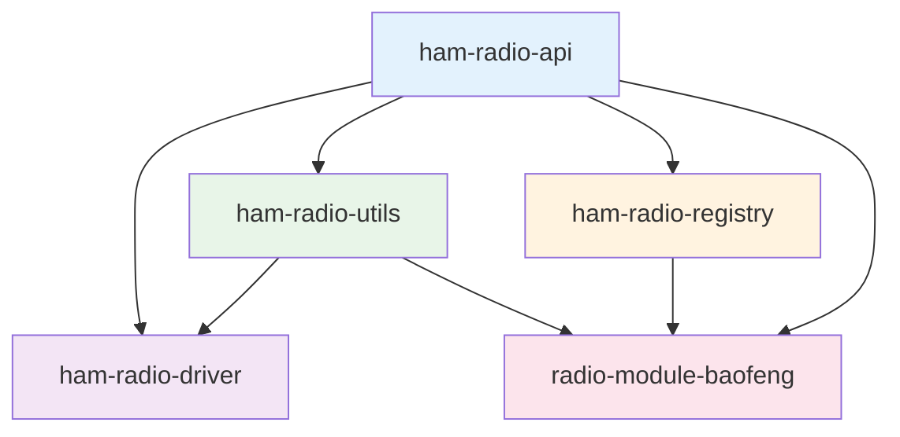

# Module Comparison

This document provides a quick reference comparison of all modules in the HamBench ecosystem.

## Quick Reference Table

| Module | Purpose | Key Exports | Dependencies | Type |
|--------|---------|-------------|--------------|------|
| `@springfield/ham-radio-api` | Core type definitions and interfaces | `RadioDriver`, `RadioCodec`, branded types | `loglayer`, `ts-brand` | Core API |
| `@springfield/ham-radio-driver` | Protocol interpreter and serial communication | `RadioDriver`, `ProtocolInterpreter` | `@springfield/ham-radio-api`, `@springfield/ham-radio-utils`, `serialport` | Driver |
| `@springfield/ham-radio-utils` | Shared utilities and helper functions | `SegmentedMemory`, `UILogger`, validation functions | `@springfield/ham-radio-api`, `ajv`, `fishery` | Utilities |
| `@springfield/ham-radio-registry` | Plugin discovery and management | `RadioConfigRegistry`, `NpmBasedConfigRegistry` | `@springfield/ham-radio-api`, `loglayer` | Registry |
| `radio-module-baofeng` | Baofeng radio-specific implementation | JSON configs + memory maps | `@springfield/ham-radio-api`, `@springfield/ham-radio-utils` | Radio Module |
| `radio-module-kenwood` | Kenwood TH-F6 (live CAT memories), TH-D74 (clone + CAT), TM-D710A (clone + CAT) | JSON configs + memory maps | `@springfield/ham-radio-api`, `@springfield/ham-radio-utils` | Radio Module |

## Module Details

### @springfield/ham-radio-api
**Layer**: Core API  
**Role**: Foundation layer that defines all types and interfaces

**Key Responsibilities**:
- Define core interfaces (`RadioDriver`, `RadioCodec`, etc.)
- Provide branded types for type safety
- Define spectrum and license management types
- Establish contracts between all modules

**When to use**: Required by all other modules as the foundation layer

### @springfield/ham-radio-driver
**Layer**: Driver  
**Role**: Implements radio communication logic

**Key Responsibilities**:
- Execute DSL-based radio protocols
- Handle serial port communication
- Manage protocol step execution
- Provide progress tracking and cancellation

**When to use**: When you need to communicate with physical radio hardware

### @springfield/ham-radio-utils
**Layer**: Utilities  
**Role**: Provides shared utilities and helper functions

**Key Responsibilities**:
- Memory management utilities
- Schema validation
- UI logging and progress reporting
- Test data factories
- Data conversion utilities

**When to use**: When you need common utilities for memory handling, validation, or testing

### @springfield/ham-radio-registry
**Layer**: Registry  
**Role**: Manages plugin discovery and configuration loading

**Key Responsibilities**:
- Discover radio configurations from installed JSON modules
- Validate and load configurations
- Manage shared components
- Handle plugin installation

**When to use**: When you need to discover and load radio configurations dynamically

### radio-module-baofeng
**Layer**: Radio Module  
**Role**: Radio-specific implementation example

**Key Responsibilities**:
- Provide Baofeng UV-5R specific configuration
- Implement Baofeng-specific codec
- Define memory layout and protocols
- Handle Baofeng communication protocols

**When to use**: As a reference implementation for creating new radio modules

## Dependency Graph



## Module Relationships

### Core Dependencies
- **ham-radio-api** is the foundation that all other modules depend on
- **ham-radio-utils** provides utilities used by driver and radio modules
- **ham-radio-registry** discovers and manages radio modules
- **ham-radio-driver** implements the communication layer
- **radio-module-baofeng** is an example radio-specific implementation

### Usage Patterns

#### Application Development
```typescript
// 1. Use registry to discover available radios
import { createRegistry } from '@springfield/ham-radio-registry';
const registry = createRegistry(logger);
const configs = await registry.discoverConfigurations();

// 2. Get specific configuration and codec
const config = await registry.getConfiguration('baofeng:uv5r');
const codec = await registry.getCodec('baofeng:uv5r');

// 3. Use driver for communication
import { RadioDriver } from '@springfield/ham-radio-driver';
const driver = new RadioDriver(config, logger);
const memory = await driver.readRadio('/dev/ttyUSB0', progress);

// 4. Use codec for data conversion
const program = codec.decode(memory);
```

#### Radio Module Development
```typescript
// 1. Depend on core API
import type { RadioCodec, RadioModelId } from '@springfield/ham-radio-api';

// 2. Use utilities for common operations
import { SegmentedMemory, validateSchema } from '@springfield/ham-radio-utils';

// 3. Implement radio-specific codec
export class MyRadioCodec implements RadioCodec {
  decode(memory: RadioMemory): RadioProgram { /* ... */ }
  encode(program: RadioProgram, memory: RadioMemory): RadioMemory { /* ... */ }
}
```

## Module Selection Guide

### For Application Developers
1. **Start with ham-radio-api** - Understand the core types and interfaces
2. **Use ham-radio-registry** - Discover and load radio configurations
3. **Use ham-radio-driver** - Communicate with physical radios
4. **Use ham-radio-utils** - For memory handling and validation

### For Radio Module Developers
1. **Depend on ham-radio-api** - Implement the required interfaces
2. **Use ham-radio-utils** - Leverage shared utilities and test factories
3. **Follow radio-module-baofeng pattern** - Use as reference implementation
4. **Register with ham-radio-registry** - Make your module discoverable

### For Driver Extensions
1. **Extend ham-radio-driver** - Add custom protocol executors
2. **Use ham-radio-utils** - For logging and progress reporting
3. **Follow existing patterns** - Maintain consistency with core driver

## Version Compatibility

All modules follow semantic versioning and maintain compatibility within major versions:

- **ham-radio-api**: Breaking changes require major version bumps
- **ham-radio-driver**: Compatible with ham-radio-api v16+
- **ham-radio-utils**: Compatible with ham-radio-api v14+
- **ham-radio-registry**: Compatible with ham-radio-api v16+
- **radio-module-baofeng**: Compatible with ham-radio-api v16+

## Performance Characteristics

| Module | Startup Time | Memory Usage | Runtime Performance |
|--------|-------------|--------------|-------------------|
| ham-radio-api | Fast | Low | N/A (types only) |
| ham-radio-driver | Medium | Medium | High (serial I/O) |
| ham-radio-utils | Fast | Low | High (utilities) |
| ham-radio-registry | Slow | Medium | Medium (file I/O) |
| radio-module-baofeng | Fast | Low | High (data conversion) |

## Security Considerations

| Module | Security Level | Key Concerns | Mitigations |
|--------|---------------|--------------|-------------|
| ham-radio-api | High | Type safety | Branded types, strict TypeScript |
| ham-radio-driver | Medium | Serial I/O | Input validation, error handling |
| ham-radio-utils | High | Data validation | Schema validation, sanitization |
| ham-radio-registry | Medium | Plugin loading | Schema validation, sandboxing |
| radio-module-baofeng | High | Data integrity | Validation, error handling | 
