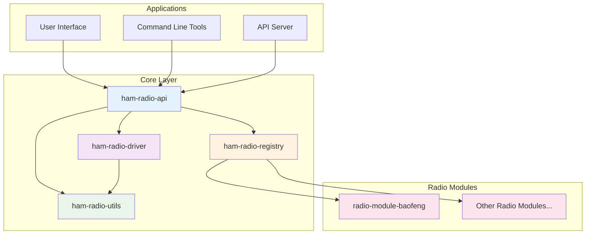

# HamBench Overview

Welcome to the HamBench software ecosystem - a comprehensive, modular platform designed for amateur radio programming and management. This project provides everything you need to discover, configure, and manage radio modules with ease.

## What is HamBench?

HamBench is an open-source software ecosystem that simplifies the process of programming and managing amateur radio equipment. It provides a standardized way to communicate with different radio models, manage configurations, and extend support for new radio types through a plugin architecture.

### Key Benefits

- **Universal Compatibility**: Support for multiple radio manufacturers and models
- **Plugin Architecture**: Easy to add support for new radio types
- **Type Safety**: Built with TypeScript for robust, error-free development
- **Modular Design**: Clean separation of concerns with reusable components
- **Open Source**: Community-driven development with transparent codebase

## Core Architecture

The ecosystem is built around five core modules that work together seamlessly:



### Module Overview

| Module | Purpose | Key Features |
|--------|---------|-------------|
| **ham-radio-api** | Core type definitions and interfaces | Type-safe interfaces, branded types, spectrum management |
| **ham-radio-driver** | Radio communication and protocol handling | DSL-based protocols, serial communication, progress tracking |
| **ham-radio-utils** | Shared utilities and helper functions | Memory management, validation, UI logging, test utilities |
| **ham-radio-registry** | Plugin discovery and management | NPM-based discovery, configuration validation, shared components |
| **radio-module-* ** | Radio-specific implementations | Model-specific codecs, protocols, and configurations |

For detailed module information, see the [Module Comparison](/module-comparison) guide.

## Key Features

### 🔌 Plugin Architecture
The registry system allows third-party developers to create and distribute radio configurations as npm packages. This means:
- Easy discovery of new radio support
- Automatic validation and loading
- Shared components across related models
- Standardized module structure

### 🛡️ Security First
Built-in security measures ensure safe loading of third-party modules:
- Schema validation for all configurations
- Sandboxed codec execution
- Tamper detection and validation
- Secure plugin loading mechanisms

### 🔧 Protocol DSL
A domain-specific language for defining radio communication protocols:
- Complex multi-step operations
- Progress tracking and error handling
- Reusable protocol components
- Human-readable protocol definitions

### 🎯 Type Safety
Comprehensive TypeScript support throughout the ecosystem:
- Branded types for frequencies, channels, and models
- Strict type checking for all operations
- IntelliSense support for better development experience
- Compile-time error detection

### 📊 Memory Management
Advanced memory handling capabilities:
- Segmented memory support
- Efficient data conversion utilities
- BCD encoding/decoding
- Hex formatting and validation

## Getting Started

### For Application Developers

1. **Install Core Dependencies**
   ```bash
   yarn add @springfield/ham-radio-api @springfield/ham-radio-driver @springfield/ham-radio-registry
   ```

2. **Discover Available Radios**
   ```typescript
   import { createRegistry } from '@springfield/ham-radio-registry';
   
   const registry = createRegistry(logger);
   const configs = await registry.discoverConfigurations();
   console.log('Available radios:', configs.map(c => c.modelId));
   ```

3. **Read Radio Memory**
   ```typescript
   import { RadioDriver } from '@springfield/ham-radio-driver';
   
   const config = await registry.getConfiguration('baofeng:uv5r');
   const driver = new RadioDriver(config, logger);
   const memory = await driver.readRadio('/dev/ttyUSB0', progressIndicator);
   ```

### For Radio Module Developers

1. **Create Module Structure**
   ```
   radio-module-yourbrand/
   ├── package.json
   ├── src/
   │   ├── index.ts
   │   ├── codec-factory.ts
   │   └── shared/
   │       ├── codecs/
   │       └── schemas/
   └── configs/
       └── your-model.json
   ```

2. **Implement Required Interfaces**
   ```typescript
   import type { RadioCodec, RadioModelId } from '@springfield/ham-radio-api';
   
   export class YourRadioCodec implements RadioCodec {
     decode(memory: RadioMemory): RadioProgram {
       // Implementation here
     }
     
     encode(program: RadioProgram, memory: RadioMemory): RadioMemory {
       // Implementation here
     }
   }
   ```

3. **Publish a GitHub Release zip**
   ```bash
   yarn pack:release
   ```
   Attach the zip to the GitHub Release and list it in `radio-module-catalog`. Radio modules are not published to npm.

## Supported Radio Models

Currently supported radio models include:

- **Baofeng UV-5R** - Full support with memory management and configuration
- **Kenwood TH-F6** - Live CAT programming
- **Kenwood TH-D74** - Clone-mode programming
- **Kenwood TM-D710A** - Clone-mode programming
- **More coming soon** - The plugin architecture makes it easy to add new models

## Documentation Structure

- **[Architecture](./architecture.md)** - Detailed system architecture and module relationships
- **[Module Comparison](./module-comparison.md)** - Quick reference for all modules
- **[Development Guide](./development-guide.md)** - Comprehensive development documentation
- **[Registry Documentation](./registry/)** - Plugin system and registry management
- **[Protocol DSL](./protocols/)** - Protocol definition language documentation

## Contributing

We welcome contributions from the amateur radio community! Whether you're:
- Adding support for a new radio model
- Improving existing functionality
- Fixing bugs or adding features
- Writing documentation

Please see our [Development Guide](./development-guide.md) for detailed contribution guidelines.

## Community

- **GitHub**: [springfield-ham-radio](https://github.com/springfield-ham-radio)
- **Issues**: Report bugs and request features
- **Discussions**: Share ideas and get help
- **Pull Requests**: Contribute code and improvements

## License

This project is open source and available under the MIT License. See the LICENSE file for details.

---

Ready to get started? Check out the [Architecture Overview](./architecture.md) for a detailed look at how everything works together, or jump into the [Development Guide](./development-guide.md) to start building with the ecosystem. 
