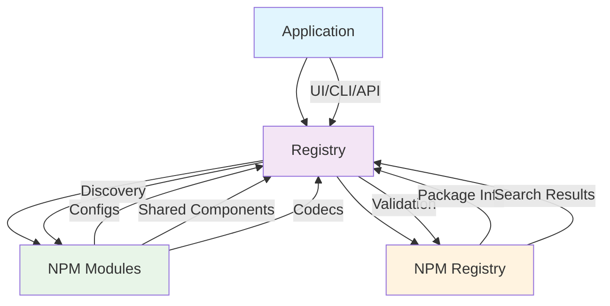
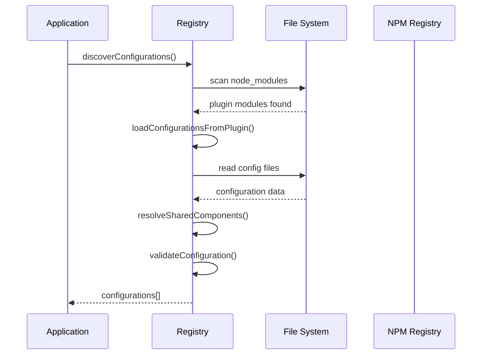
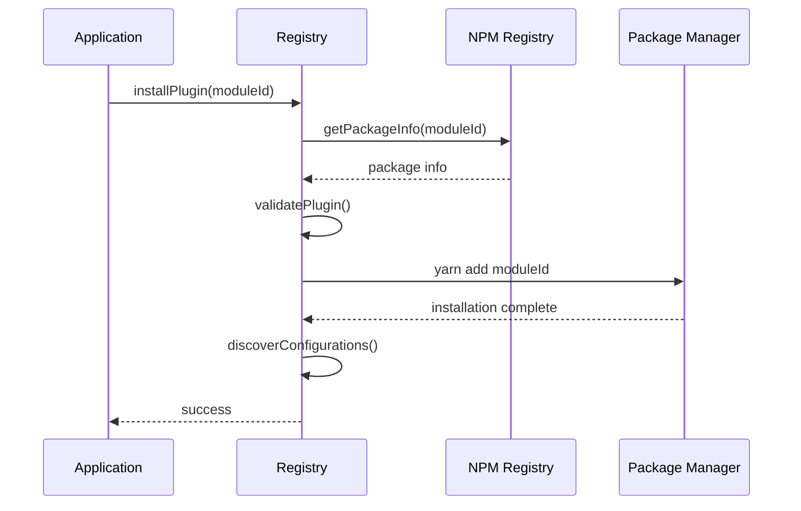
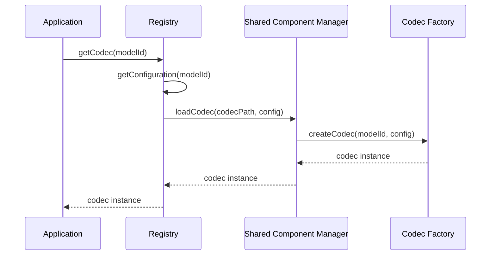

# Registry Architecture

> **Note**: This document focuses specifically on the Registry module architecture. For a high-level overview of the entire architecture, see the [Architecture Overview](/reference/architecture).

The Ham Radio Registry is built with a modular, extensible architecture that supports both official and third-party radio modules. This page explains the technical design and how the registry components work together.

## System Overview

The registry consists of several key components that work together to provide a unified interface for discovering and managing radio configurations:



## Core Components

### 1. **RadioConfigRegistry Interface**

The main interface that applications interact with:

```typescript
interface RadioConfigRegistry {
  // Discovery
  discoverConfigurations(): Promise<RegistryRadio[]>;
  getConfiguration(configId: string): Promise<RegistryRadio | null>;
  getConfigurationsByManufacturer(manufacturer: string): Promise<RegistryRadio[]>;
  getConfigurationsByModule(moduleId: string): Promise<RegistryRadio[]>;
  
  // Management
  validateConfiguration(config: RegistryRadio): ValidationResult;
  registerConfiguration(config: RegistryRadio): Promise<void>;
  installPlugin(moduleId: string): Promise<void>;
  listInstalledPlugins(): Promise<PluginModule[]>;
  
  // Codec Support
  getCodec(modelId: RadioModelId): Promise<RadioCodec | null>;
}
```

### 2. **NpmBasedConfigRegistry Implementation**

The main implementation that handles npm-based discovery:

```typescript
class NpmBasedConfigRegistry implements RadioConfigRegistry {
  private configCache = new Map<string, RegistryRadio>();
  private pluginCache = new Map<string, PluginModule>();
  private codecCache = new Map<string, RadioCodec>();
  private sharedComponentManager: SharedComponentManager;
  private npmClient: NpmClient;
  private logger: ILogLayer;
  
  // Implementation methods...
}
```

### 3. **Shared Component Management**

Handles loading and managing shared components across radio models:

```typescript
interface SharedComponentManager {
  loadSchema(schemaPath: string): Promise<any>;
  loadProtocol(protocolPath: string): Promise<any>;
  loadCodec(codecPath: string, config: any): Promise<RadioCodec>;
  resolveReference(reference: string, basePath: string): string;
}
```

### 4. **NPM Client**

Interfaces with the npm registry for package discovery and validation:

```typescript
interface NpmClient {
  getPackageInfo(packageName: string): Promise<any>;
  searchPackages(query: string): Promise<NpmPluginInfo[]>;
  getPackageStats(packageName: string): Promise<any>;
  validatePackage(packageName: string): Promise<boolean>;
}
```

## Data Flow

### 1. **Configuration Discovery**



### 2. **Plugin Installation**



### 3. **Codec Loading**



## Module Structure

### Standard Module Layout

```
radio-module-manufacturer/
├── package.json                    # Module metadata and configuration
├── configs/                        # Radio configuration files
│   ├── model1.json                # Complete configuration for model 1
│   └── model2.json                # Complete configuration for model 2
├── src/                            # Module source code
│   ├── shared/                     # Shared components
│   │   ├── schemas/                # Shared JSON schemas
│   │   │   ├── channel-schema.json
│   │   │   └── settings-schema.json
│   │   ├── protocols/              # Shared protocol definitions
│   │   │   ├── handshake.json
│   │   │   └── memory-access.json
│   │   └── codecs/                 # Shared codec implementations
│   │       ├── manufacturer-codec.ts
│   │       ├── manufacturer-decoder.ts
│   │       └── manufacturer-encoder.ts
│   ├── index.ts                    # Main module entry point
│   └── codec-factory.ts            # Codec factory implementation
└── README.md                       # Module documentation
```

### Package.json Configuration

```json
{
  "name": "@springfield/radio-module-baofeng",
  "version": "1.0.0",
  "description": "Radio module for Baofeng UV-5R series",
  "keywords": ["ham-radio", "radio-module", "baofeng"],
  "springfield": {
    "pluginType": "radio-module",
    "version": "1.0.0",
    "manufacturer": "Baofeng",
    "supportedRadios": ["uv5r", "uv5r-plus", "uv82"],
    "capabilities": {
      "dslProtocols": true,
      "customCodecs": true,
      "memoryRead": true,
      "memoryWrite": true,
      "sharedComponents": true
    },
    "configPath": "configs",
    "sharedPath": "src/shared",
    "codecFactory": "src/codec-factory.ts"
  },
  "peerDependencies": {
    "@springfield/ham-radio-api": "^12.0.0"
  }
}
```

## Configuration Schema

### Radio Configuration Structure

```typescript
interface RegistryRadio {
  $schema?: string;
  id: {
    model: string;
    name: string;
    manufacturer: string;
  };
  version: string;
  description: string;
  capabilities: RadioCapabilities;
  serialConfig: SerialConfig;
  memoryConfig: MemoryConfig;
  readMemory: ProtocolStep[];
  writeMemory: ProtocolStep[];
  settingsSchema: {
    model: string;
    settingsSchema: any;
    channelSchema: any;
  };
  codec?: CodecConfig;
  metadata: RadioConfigMetadata;
}
```

### Shared Component References

Configurations can reference shared components:

```json
{
  "settingsSchema": {
    "model": "baofeng-uv5r",
    "settingsSchema": {
      "$ref": "src/shared/schemas/settings-schema.json"
    },
    "channelSchema": {
      "$ref": "src/shared/schemas/channel-schema.json"
    }
  },
  "codec": {
    "type": "shared",
    "reference": "src/shared/codecs/baofeng-codec.ts",
    "config": {
      "channelSize": 16,
      "magicNumber": [80, 187, 255, 32, 18, 7, 37]
    }
  }
}
```

## Security Architecture

### 1. **Module Validation**

- Package.json validation
- Required field checking
- Version compatibility verification
- Security issue detection

### 2. **Configuration Validation**

- Schema validation
- File path verification
- Reference resolution checking
- Malicious content detection

### 3. **Code Execution Safety**

- Sandboxed codec loading
- Dynamic import validation
- Code pattern analysis
- Execution environment isolation

### 4. **Tamper Detection**

- Checksum verification
- Signature validation
- File integrity checking
- Modification detection

## Caching Strategy

The registry implements a multi-level caching strategy:

### 1. **Configuration Cache**
- Caches loaded configurations by model ID
- Reduces file system access
- Improves response times

### 2. **Plugin Cache**
- Caches discovered plugin modules
- Avoids repeated node_modules scanning
- Maintains plugin metadata

### 3. **Codec Cache**
- Caches instantiated codecs by model ID
- Reduces codec factory overhead
- Improves performance for repeated access

### 4. **NPM Cache**
- Caches npm registry responses
- Reduces network requests
- Improves search performance

## Error Handling

The registry implements comprehensive error handling:

### 1. **Graceful Degradation**
- Continues operation if individual modules fail
- Provides fallback mechanisms
- Logs errors for debugging

### 2. **Validation Errors**
- Detailed error messages
- Specific validation failures
- Suggested fixes

### 3. **Network Errors**
- Retry mechanisms
- Timeout handling
- Offline mode support

### 4. **Security Errors**
- Immediate failure on security issues
- Detailed security reporting
- Audit trail maintenance

## Performance Considerations

### 1. **Lazy Loading**
- Configurations loaded on demand
- Codecs instantiated when needed
- Shared components cached after first load

### 2. **Parallel Processing**
- Concurrent module discovery
- Parallel configuration loading
- Async validation processes

### 3. **Memory Management**
- Efficient caching strategies
- Memory leak prevention
- Resource cleanup

### 4. **File System Optimization**
- Minimized file system access
- Efficient directory scanning
- Smart file watching

## Extensibility Points

The architecture provides several extension points:

### 1. **Custom Registry Implementations**
- Implement `RadioConfigRegistry` interface
- Support different storage backends
- Custom discovery mechanisms

### 2. **Custom Shared Component Managers**
- Implement `SharedComponentManager` interface
- Support different component types
- Custom loading strategies

### 3. **Custom NPM Clients**
- Implement `NpmClient` interface
- Support different registries
- Custom search algorithms

### 4. **Plugin Hooks**
- Pre-installation hooks
- Post-discovery hooks
- Validation hooks

This architecture provides a solid foundation for a scalable, secure, and extensible radio configuration management system. 
